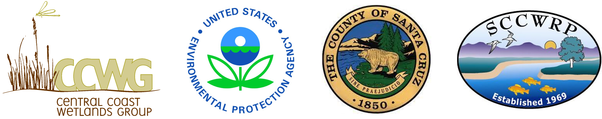

<br>

```{r, fig.align = 'center', out.height = '60%', echo = F}
knitr::include_graphics('www/report_image.png')
```

<br>

### Overview

Program website: <http://scceh.com/steelhead.aspx>

The Juvenile Salmonid and Stream Habitat (JSSH) Database includes monitoring data of salmonid density and stream habitat characteristics in four watersheds in Santa Cruz County, California.  Since 1994, data have been collected every fall, with one survey available in 1981.  Salmonid data include steelhead density in two size classes and presence/absence of Coho salmon. Additional presence/absence data are available for select species of fish, amphibians, and reptiles.  Stream morphometry, riparian, and bed characteristics are measured in each reach separately for pools, runs, or riffles.  All data have been combined in a geodatabase with spatially referenced information for each survey. 

### Objectives and approach 

Analysis of the JSSH Database (see [here](https://www.arcgis.com/home/item.html?id=6d9b81bf5b2b4b309f5ff097e0edcfaa#overview)) is driven by the following questions:

* What is the status and trends of the steelhead and coho populations in these four watersheds?

* Where do fish and wildlife species occur in these four watersheds? 

* What are stream habitat conditions in these four watersheds?

* How can information about the steelhead and coho salmon populations and stream habitat conditions inform conservation and restoration efforts?  

The analysis will be exploratory to address the general questions and to provide information for follow-up analysis. Our approach will begin by addressing each question in sequence as a means to address the final question.  Unless noted otherwise, all analyses will be separate for each watershed. __The tabs above link to each step described below.  Please be patient for each page to load - there is no loading bar.__

1) [__Steelhead status and trends__](saltrends.Rmd): Status and annual trends in steelhead density by size class and individual sites

1) [__Factor associated with trends__](varimp.Rmd): Factors associated with steelhead density trends 

1) [__Community analysis__](comman.Rmd): Community analysis of each watershed using species presence/absence, changes over time

1) [__Community and habitat analysis__](commhaban.Rmd): Multivariate analysis of association between habitat measurements and community composition, changes over time, uses habitat data collected at fish sampling sites

1) Habitat analysis

     * [__Site__](haban.Rmd): Analysis of habitat differences between riffle, runs, and pools, changes over time, uses habitat data collected at fish sampling sites

     * [__Reach__](rchan.Rmd): Analysis of habitat changes at approximate 1/2 mile reach segments

     * [__San Lorenzo flow__](slrflo.Rmd): Analysis of modelled flow changes in the San Lorenzo watershed, comparisons with changes in steelhead density
          
     * [__Soquel flow__](soqflo.Rmd): Analysis of modelled flow changes in the Soquel watershed, comparisons with changes in steelhead density

     * [__Pajaro flow__](pajflo.Rmd): Analysis of modelled flow changes in the Pajaro watershed, comparisons with changes in steelhead density

### Variable names

Species and habitat variables are shown on the web page as in the raw data. For reference, the complete descriptions are shown here.

Species names:

__A_goby__: arrow goby, __BayPF__: bay pipefish, __Bl_Fg__: bull frog, __Bl_Gill__: bluegill, __Brwn_Tr__: brown turtle, __Brwn_trt__: brown trout, __Ca_Nwt__: California newt, __Ca_Rch__: California roach, __Coho__: coho salmon, __Cst_Sculp__: coastrange sculpin, __Dace__: dace, __Gi_Sal__: giant salamander, __Gld_Fish__: goldfish, __Gld_Shin__: golden shiner, __Grn_SF__: green sunfish, __HCH__: hitch, __Lamp__: lamprey, __LM_Bass__: large mouth bass, __MQF__: mosquitofish, __NWT__: newt, __Pac_herr__: Pacific herring, __Pike_Minw__: pike minnow, __Prk_Sculp__: prickly sculpin, __Rd_Fg__: redlegged frog, __Rgh_Nwt__: roughlegged newt, __Rif_Sculp__: riffle sculpin, __Sa_Suck__: Sacramento sucker, __Shin_SP__: shiner species, __Sln_Sal__: slender salamander, __Stag_Scul__: staghorn sculpin, __Sthd__: steelhead, __SthdRT__: rainbow trout, __Stick__: stickleback, __Stp_Mull__: striped mullet, __Str_Flo__: starry flounder, __T_goby__: tidewater goby, __Tp_Smlt__: topsmelt, __Ws_Turt__: western pond turtle, __YF_goby__: yellowfin goby, __Ywl_Fg__: yellowlegged frog

Habitat variable names:

__Can__: Canopy cover (%), __Decid__: Deciduous canopy cover (%), __DpthAvg__: Average depth (ft), __DpthMax__: Maximum depth (ft), __Embed__: Embeddedness (%), __EsCov__: Escape cover (ratio), __Fines__: Fines (%), __Lgth__: Station length (ft), __Wdth__: Station width (ft)

### Attribution

All site content and analyses by [Marcus Beck](mailto:marcusb@sccwrp.org). Raw data collected and graciously provided by the [JSSH monitoring program](http://scceh.com/steelhead.aspx) in Santa Cruz County, California. Please visit [here](https://github.com/fawda123/jssh_web) to view the web page source content.  Funding is provided in part by [USEPA Region 9](https://www.epa.gov/aboutepa/epa-region-9-pacific-southwest) in coordination with [Central Coast Wetlands Group](https://www.mlml.calstate.edu/ccwg/) at Moss Landing Marine Labs and the [County of Santa Cruz](http://www.co.santa-cruz.ca.us/).


